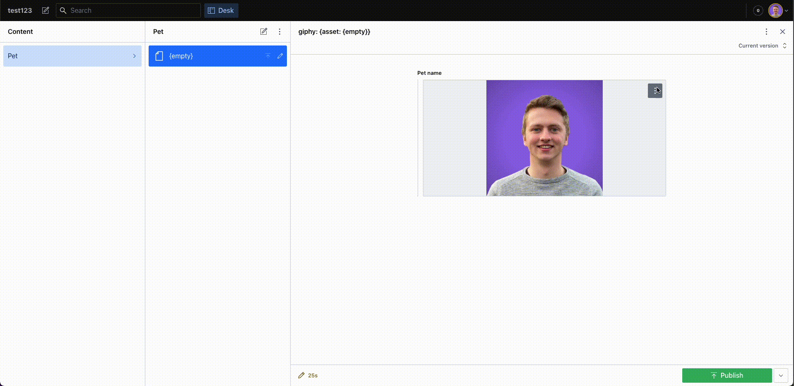

# sanity-plugin-asset-source-remove-bg

> **NOTE**
>
> This is the **Sanity Studio v3 version** of sanity-plugin-asset-source-giphy.

## What is it?

Plugin for [Sanity Studio](https://www.sanity.io) providing asset source for removing the background of existing images with the [Remove.bg](https://www.remove.bg) API.
_Caution: The service offers 50 free preview images each month, which are of a lower quality, but you are able to purchase credits at their website. (I am not affiliated by any means with Remove.bg)_

**Features**

- Remove the background of images.
- Select the type and format of the images.
- See remaining free previews and credits left in your account.
- Select which Sanity user roles are allowed to use the API.

**What might be added**

- Set a custom background color or picture.
- Batch conversion
- ??? any suggestions?

  

## Installation

```
npm install --save sanity-plugin-asset-source-remove-bg
```

or

```
yarn add sanity-plugin-asset-source-remove-bg
```

## Usage

Parameters:

- apiKey: String | Can be created here: [Remove.bg](https://remove.bg/dashboard#api-key)
- allowedUserRoles?: String[]

  Add it as a plugin in sanity.config.ts (or .js):

```
 import {createConfig} from 'sanity'
 import {removeBgAssetSourcePlugin} from 'sanity-plugin-remove-bg-converter'

 export const createConfig({
     /...
     plugins: [
         removeBgAssetSourcePlugin({
             apiKey: "my-api-key",
             allowedUserRoles: ["administrator", "editor"]
         })
     ]
 })
```

## Develop & test

Make sure to run `npm run build` once, then run

```bash
npm run link-watch
```

In another shell, `cd` to your test studio and run:

```bash
npx yalc add sanity-plugin-asset-source-giphy --link && yarn install
```

Now, changes in this repo will be automatically built and pushed to the studio,
triggering hotreload. Yalc avoids issues with react-hooks that are typical when using yarn/npm link.

### About build & watch

This plugin uses [@sanity/plugin-kit](https://github.com/sanity-io/plugin-kit)
with default configuration for build & watch scripts.

## License

MIT © Rein Undheim
See LICENSE
